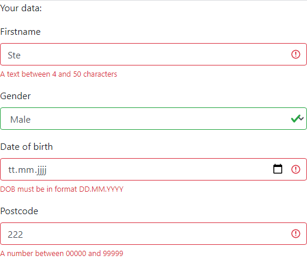
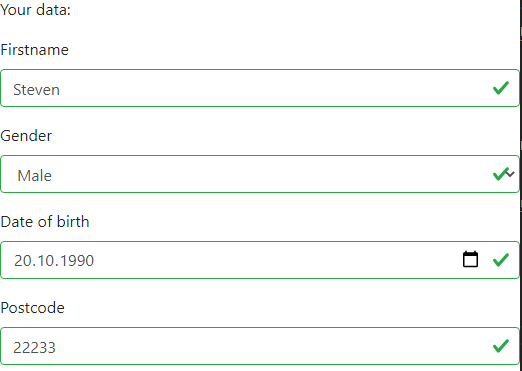

# react-state-validator

[](LICENSE) [](https://badge.fury.io/js/%40burnett01%2Freact-state-validator)

A state props validator that supports custom rules.

Perfectly blends in with [reactstrap](https://reactstrap.github.io/)'s form components.

---

# Table of contents
* [API](#api)
* [Setup / Install](#setup--install)
* [Example](#example-app)
* [Contributing](#contributing)
* [License](#license)

---

## API

## ``this.state = {}``

Set the inital component state props.

Example:

```javascript
this.state = {
  firstname: ''
}
```

## ``this.validationRules(object)``

Add the validation rules by passing an object in the following manner:

```text
{
  stateProp: {
    ruleName: ruleOptions
  }
}
```

Example:

```javascript
this.validationRules({
  firstname: {
    minLen: 4
  }
})
```

## ``this.validateState(stateProp)``

Validates a stateProp.

Returns with a boolean whether state is valid.

## ``this.setStateValidate(stateProp, value)``

Sets a value of a stateProp and validates it.


## ``this.isValid(stateProp)``

UI-binding for reactstrap (visual validation).

Returns an object of whether the state is valid.

```
{
  invalid: false, 
  valid: true
}
```

---

## Setup / Install

Use `yarn add @burnett01/react-state-validator` 

Or `npm install @burnett01/react-state-validator` 

---

## Example App

Check out the [example folder](./example) for an example app.

Deps:

`yarn add react`

`yarn add @burnett01/react-state-validator`

`yarn add bootstrap`

`yarn add reactstrap`

```javascript

import React from 'react';
import 'bootstrap/dist/css/bootstrap.css';
import { 
  Form, 
  FormGroup,
  FormFeedback,
  Label, 
  Input, 
  Row, 
  Col 
} from 'reactstrap';

import { StateValidator } from '@burnett01/react-state-validator';

export class App extends StateValidator {
  /**
   * @param {any} props
   */
  constructor(props) {
    super(props);
    /**
     * The component state.
     */
    this.state = {
      firstname: '',
      gender: 'male',
      dateofbirth: '',
      postcode: '',
      pregnancy: ''
    };
    /**
     * Rules setup for validation.
     */
    this.validationRules({
      firstname: { 
        minLen: 4,
        maxLen: 50,
      },
      gender: { 
        has: ['male', 'female', 'diverse'],
      },
      dateofbirth: {
        regex: /^\d{4}-\d{2}-\d{2}$/
      },
      postcode: {
        len: 5
      },
      pregnancy: {
        notIf: [{ field: 'gender', value: 'male' }],
        has: ['yes', 'no', 'maybe'],
      }
    });
  }
  /**
   * onChange event handler.
   * @param {Event}
   */
  onChange = ({ target: { name, value }}) => {
    this.setStateValidate(name, value)
  }
  /**
   * onBlur event handler.
   * @param {Event}
   */
  onBlur = ({ target: { name, value }}) =>
    this.setStateValidate(name, value);
  /**
   * onClick event handler.
   * @param {Event}
   */
  onClick = ({ target: { name, value }}) =>
    this.setStateValidate(name, value);

  /**
   * Render method.
   */
  render() {
    return (
      <div>
        <p>Your data:</p>
        <Form>
          <FormGroup>
            <Label for="firstname">Firstname</Label>
            <Input
              type="text" 
              onBlur={this.onBlur}
              name="firstname"
              id="firstname" 
              {...this.isValid('firstname')}
              />
              <FormFeedback>
                Ein Text zwischen 4 und 50 Zeichen
              </FormFeedback>
          </FormGroup>
          <FormGroup>
            <Label for="gender">Gender</Label>
            <Input 
              type="select" 
              onChange={this.onChange}
              name="gender"
              id="gender"
              {...this.isValid('gender')}>
              <option value="male">Male</option>
              <option value="female">Female</option>
              <option value="diverse">Diverse</option>
            </Input>
            <FormFeedback>
              One of male, female or diverse
            </FormFeedback>
          </FormGroup>
          <FormGroup>
            <Label for="dateofbirth">Date of birth</Label>
            <Input 
              type="date" 
              name="dateofbirth" 
              id="dateofbirth"
              onBlur={this.onBlur}
              {...this.isValid('dateofbirth')}/>
              <FormFeedback>
                DOB must be in format DD.MM.YYYY
              </FormFeedback>
          </FormGroup>
          <FormGroup>
            <Row>
              <Col lg="3">
                <Label for="postcode">Postcode</Label>
                <Input 
                  type="number" 
                  min="00000"
                  max="99999"
                  step="1" 
                  placeholder="PLZ"
                  name="postcode" 
                  id="postcode"
                  onBlur={this.onBlur}
                  {...this.isValid('postcode')}/>
                  <FormFeedback>
                    A number between 00000 and 99999
                  </FormFeedback>
              </Col>
            </Row>
          </FormGroup>
        </Form>
      </div>);
  }
}

export default App;
```

Result:





---

## Unit-Tests

Todo

---

## Contributing

You're very welcome and free to contribute. Thank you.

---

## License

[MIT](LICENSE)
